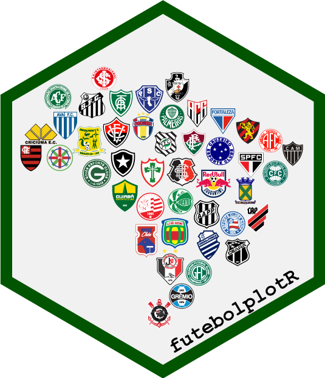

<!-- README.md is generated from README.Rmd. Please edit that file -->

# **futebolplotR** <a href="https://brunomioto.github.io/futebolplotR/"></a>

<!-- badges: start -->

[](https://lifecycle.r-lib.org/articles/stages.html#experimental)
[](https://CRAN.R-project.org/package=futebolplotR)

<!-- badges: end -->

The goal of **futebolplotR** is to provide functions and geoms that help
creating visualization of **Brazilian soccer** related analysis. It
provides a ggplot2 geom that does the heavy lifting of plotting
Brazilian soccer badges in high quality, with correct aspect ratio and
possible transparency.

The **futebolplotR** contains emblems of the teams that have
participated in the Brasileirão Série A soccer league from 2003 to the
present day. Other teams are also welcome!

This package can be used with data from
[brasileirao](https://github.com/williamorim/brasileirao) R package.

The code for this package was **heavily** based on
[nbaplotR](https://mrcaseb.github.io/nbaplotR/) with minor changes to
support Brazilian soccer team badges.

## Installation

You can install the development version of futebolplotR from
[GitHub](https://github.com/brunomioto/futebolplotR/) with:

``` r
if (!require("pak")) install.packages("pak")
pak::pak("brunomioto/futebolplotR")
```

## Using futebolplotR

The key function in the package is `geom_futebol_badges()` which will
add Brazilian soccer team badges to a ggplot. Here you can see all the
current available teams (currently 44) to plot.

``` r
library(futebolplotR)
library(ggplot2)

team <- futebolplotR::valid_team_names()

df <- data.frame(
  a = c(rep(1:5, 8),c(1,2,3,4)),
  b = sort(c(rep(1:8, 5), c(0,0,0,0)), decreasing = TRUE),
  teams = team
)

ggplot(df, aes(x = a, y = b)) +
  geom_futebol_badges(aes(team_abbr = teams), width = 0.1) +
  geom_label(aes(label = teams,
                 color = teams,
                 fill = teams),
             nudge_y = -0.35)+
  scale_color_futebol(type = "secondary")+
  scale_fill_futebol(type = "primary")+
  theme_void()+
  theme(
    plot.margin = margin(15,15,15,15,"pt")
  )+
  coord_cartesian(clip = "off")
```


