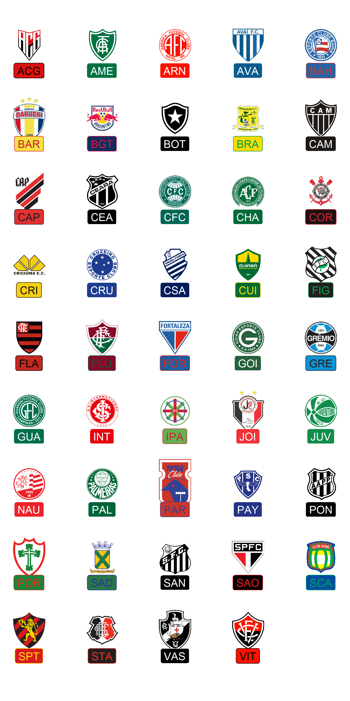

<!-- README.md is generated from README.Rmd. Please edit that file -->

# futebolplotR

<!-- badges: start -->

[](https://lifecycle.r-lib.org/articles/stages.html#experimental)
[](https://CRAN.R-project.org/package=futebolplotR)

<!-- badges: end -->

The code for this package was copied **heavily** from
[nbaplotR](https://mrcaseb.github.io/nbaplotR/) with minor changes to
support Brazilian soccer team badges.

The goal of futebolplotR is to provide functions and geoms that help
visualization of Brazilian soccer related analysis. It provides a
ggplot2 geom that does the heavy lifting of plotting brazilian soccer
logos in high quality, with correct aspect ratio and possible
transparency.

## Installation

<!-- The easiest way to get futeboplotR is to install it from [CRAN](https://cran.r-project.org/package=nbaplotR) with: -->
<!-- ``` r -->
<!-- install.packages("nbaplotR") -->
<!-- ``` -->

To get a bug fix or to use a feature from the development version, you
can install the development version of futebolplotR either from
[GitHub](https://github.com/brunomioto/futebolplotR/) with:

``` r
if (!require("pak")) install.packages("pak")
pak::pak("brunomioto/futebolplotR")
```

## Using futebolplotR

The key function in the package is geom_futebol_logos() which will add
Brazilian soccer team logos to a ggplot. Here you can see all the
current available teams to plot.

``` r
#library(futebolplotR)
library(ggplot2)

team <- valid_team_names()

df <- data.frame(
  a = c(rep(1:5, 8),c(1,2,3)),
  b = sort(c(rep(1:8, 5), c(0,0,0)), decreasing = TRUE),
  teams = team
)

ggplot(df, aes(x = a, y = b)) +
  geom_futebol_logos(aes(team_abbr = teams), width = 0.1) +
  geom_label(aes(label = teams), nudge_y = -0.35)+
  theme_void()+
  theme(
    plot.margin = margin(15,15,15,15,"pt")
  )+
  coord_cartesian(clip = "off")
```


